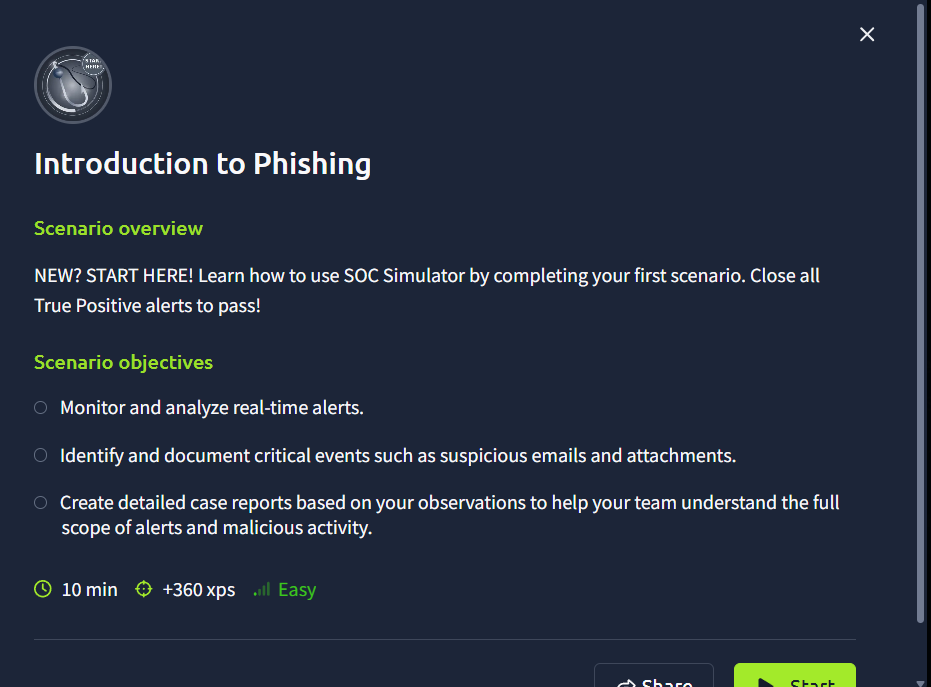

# Introduction to Phishing (TryHackMe SOC Simulator)

Cenário de nível fácil do SOC Simulator. A tarefa era monitorar os alertas em tempo real, investigar no Splunk e escrever um relatório para cada caso. Foram 4 alertas: 3 True Positives e 1 False Positive.

## Resumo

| ID | Alerta | Severidade | Classificação | Escalonar |
|----|--------|------------|---------------|-----------|
| 8814 | E-mail recebido com link externo suspeito | Medium | False Positive | Não |
| 8815 | E-mail recebido com link externo suspeito | Medium | True Positive | Não |
| 8816 | Acesso a URL da blacklist bloqueado pelo firewall | High | True Positive | Não |
| 8817 | E-mail recebido com link externo suspeito | Medium | True Positive | Sim |

## Como investiguei

- Busca no Splunk por domínio, URL e remetente nos logs de e-mail e firewall
- Conferência de `Action` (allowed ou blocked), IP de origem e horário
- Análise das URLs no tryDetectThis
- Checagem de sinais de phishing: typosquatting, link encurtado, urgência e saudação genérica

## Alerta 8814 (False Positive)

**Time of activity:** 21/09/2026 às 17:09

**Entidades relacionadas:**
- Remetente: onboarding@hrconnex.thm
- Domínio: hrconnex.thm
- URL do link: https://hrconnex.thm/onboarding/15400654060/j.garcia
- Destinatária do e-mail: j.garcia@thetrydaily.thm
- Quem reportou: h.harris@thetrydaily.thm

**Motivo da classificação:** um e-mail interno mostrou que o hrconnex.thm é o novo parceiro terceirizado de RH da empresa, e que a funcionária estava esperando o e-mail de onboarding. O conteúdo condiz com o processo de onboarding, não havia anexos e a URL retornou resultado limpo no tryDetectThis.

## Alerta 8815 (True Positive)

**Time of activity:** 21/09/2026 às 17:12

**Entidades afetadas:**
- Remetente: urgents@amazon.biz
- Domínio: amazon.biz
- URL: http://bit.ly/3sHkX3da12340
- Destinatária: h.harris@thetrydaily.thm
- IP de origem da tentativa de acesso: 10.20.2.17

**Motivo da classificação:** o remetente usa o domínio amazon.biz, que imita a Amazon. O e-mail tem saudação genérica, link encurtado escondendo o destino, urgência de 48 horas e pedido para confirmar dados. A URL retornou resultado malicioso no tryDetectThis. O firewall bloqueou a tentativa de acesso.

**Escalonamento:** não, porque o acesso foi bloqueado.

**Ações recomendadas:** bloquear o domínio e a URL no gateway de e-mail e no firewall, remover o e-mail da caixa da destinatária e orientar sobre phishing.

## Alerta 8816 (True Positive)

**Time of activity:** 21/09/2026 às 17:13

**Entidades afetadas:**
- Endpoint de origem: 10.20.2.17
- URL acessada: http://bit.ly/3sHkX3da12340

**Motivo da classificação:** tentativa de acesso do endpoint 10.20.2.17 à URL maliciosa (destino 67.199.248.11, porta 80), bloqueada pelo firewall pela regra "Blocked Websites".

**Escalonamento:** não, porque não houve acesso bem-sucedido.

**Ações recomendadas:** verificar outras conexões do endpoint, manter o bloqueio da URL e orientar o usuário.

## Alerta 8817 (True Positive)

**Time of activity:** 21/09/2026 às 17:14

**Entidades afetadas:**
- Endpoint de origem: 10.20.2.25
- URL acessada: https://m1crosoftsupport.co/login

**Motivo da classificação:** o domínio m1crosoftsupport.co é typosquatting da Microsoft, com o número "1" no lugar da letra "i", e leva a uma página de login falsa. O acesso foi permitido pelo firewall (destino 45.148.10.131) pela regra genérica "Allow-Internet".

**Escalonamento:** sim, porque o acesso foi permitido e existe risco de credenciais terem sido inseridas na página falsa.

**Ações recomendadas:** identificar o usuário do endpoint, confirmar se digitou credenciais, resetar a senha e revogar sessões se houver indício, isolar o endpoint, bloquear o domínio e o IP no firewall e orientar o usuário.

## O que aprendi

- True Positive e escalonamento são decisões separadas: link malicioso bloqueado não escala, acesso permitido a página de login falsa escala
- No relatório entra só o que o log mostra, sem ligar um IP a uma pessoa sem evidência
- E-mail interno pode dar o contexto que muda a classificação
- Os nomes dos campos no Splunk diferenciam maiúscula de minúscula

## Sobre a nota

Acertei a classificação nos 4 alertas, mas em dois deles (8815 e 8817) a pontuação ficou em 55/100 por "missing details". Não escondi isso aqui porque faz parte do processo: saber classificar certo é o primeiro passo, mas documentar um relatório completo é outra habilidade, e ainda tenho o que melhorar nela.
