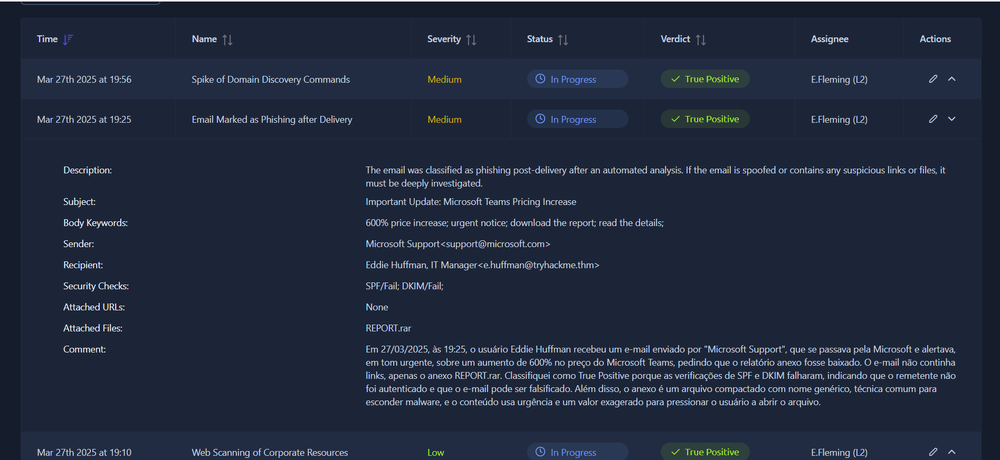

# TryHackMe: SOC L1 Alert Reporting

## 🎯 Objetivo

Praticar a escrita de relatórios de alerta para o L2, seguindo os 5 Ws (quem, o quê, quando, onde e por quê), justificando o veredito e escalando os alertas que exigem ação.

## 📋 Sobre o lab

- Plataforma: TryHackMe (painel de SOC simulado)
- A fila tinha 3 alertas. Escrevi o relatório de 2 e no terceiro fiz só o escalonamento, passando o alerta do L1 pro analista L2.
- Cada relatório era um texto único, cobrindo os 5 Ws
- O lab só dava acesso às informações do próprio alerta, então as conclusões partem do que ele mostra

## 📊 Resumo

| Alerta | Veredito | Motivo em uma linha |
|---|---|---|
| E-mail de phishing (falso aviso da Microsoft) | True Positive | SPF e DKIM falharam e o anexo era um .rar suspeito |
| Descoberta de domínio no servidor Exchange | True Positive | Servidor web iniciou um revshell.exe que rodou comandos no AD |

---

## 🚨 Alerta 1: E-mail de phishing (True Positive)

**Quem:** Eddie Huffman, IT Manager (destinatário)

**O quê:** recebeu um e-mail se passando pela Microsoft, com um aviso urgente de aumento de 600% no Microsoft Teams e pedido pra baixar um relatório. O e-mail trazia o anexo `REPORT.rar` e nenhum link.

**Quando:** 27/03/2025, às 19:25

**Onde:** e-mail enviado por "Microsoft Support" (`support@microsoft[.]com`), recebido por `e.huffman@tryhackme[.]thm`, com o anexo `REPORT.rar`

**Por quê:**
- SPF e DKIM falharam, ou seja, o remetente não foi autenticado, o que indica e-mail falsificado
- O remetente se apresenta como `microsoft.com`, mas a falha nas verificações mostra que o domínio não confirma que o e-mail veio de lá
- O anexo é um arquivo compactado com nome genérico, técnica comum para esconder malware
- O conteúdo usa urgência e um valor absurdo para pressionar o usuário a abrir o arquivo
- Não ter links não reduz o risco, porque o anexo é o vetor

**Ação recomendada:** colocar o e-mail em quarentena, bloquear o remetente e verificar se o anexo foi aberto, escalando para o L2 caso tenha sido.

### Print

---

## 🚨 Alerta 2: Descoberta de domínio no servidor Exchange (True Positive)

**Quem:** conta `NT AUTHORITY\SYSTEM`

**O quê:** o servidor começou a executar comandos para buscar informações sobre a rede da empresa, como quem são os administradores do domínio (`net group "Domain Admins" /domain` e `nltest /dclist`)

**Quando:** 27/03/2025, às 19:56

**Onde:** host `DMZ-MSEXCHANGE-2013`, um Exchange na DMZ (Windows Server 2012 R2)

**Por quê:**
- Cadeia de processos: `w3wp.exe` (servidor web) iniciou `revshell.exe`, que abriu um `cmd.exe`
- Não faz sentido o servidor web abrir esse programa, e o nome `revshell` sugere um reverse shell
- O programa estava em `C:\Users\Public`, uma pasta que qualquer usuário consegue escrever
- Os comandos rodaram como SYSTEM e mapeiam o domínio, o que não condiz com atividade normal de TI

**Ação recomendada:** isolar o servidor imediatamente e escalar para o L2 verificar se o atacante chegou a outros sistemas.

### Print

---

## ⚠️ Limitações

- Sem acesso a logs adicionais ou ferramentas de consulta, as conclusões se baseiam só nos dados dos alertas
- Num ambiente real, eu validaria com enriquecimento (reputação de domínio e arquivo) e correlação de eventos

## 📚 Lições aprendidas

- O "por quê" é a parte mais importante do relatório: dado solto não basta, precisa da justificativa do veredito
- Meu primeiro texto do Alerta 2 ficou vago e a plataforma não aceitou. O que resolveu foi acrescentar a cadeia de processos, os comandos e a ação recomendada
- Um relatório bom responde os 5 Ws logo no começo e deixa claro o que fazer em seguida
- Sinais de phishing vão além de link: falha de SPF/DKIM e anexo compactado também contam
- Escalar faz parte do trabalho do L1: quando o alerta passa da minha alçada, o certo é passar pro L2 com o relatório completo
