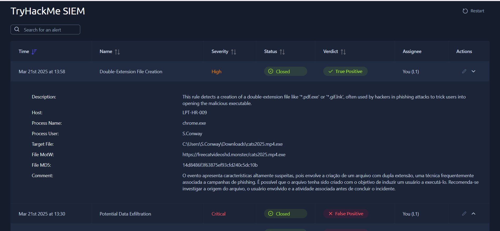
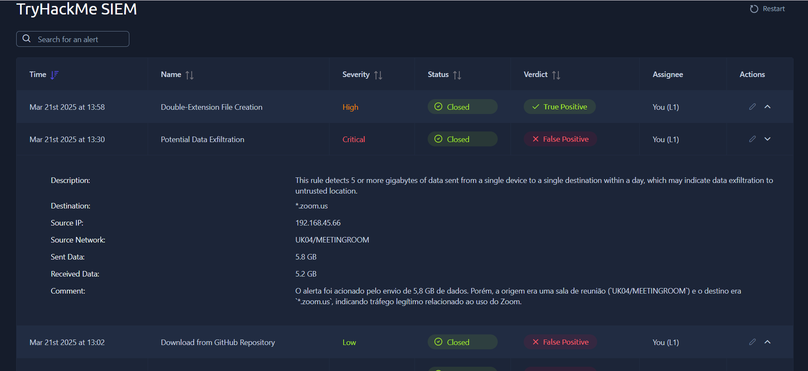
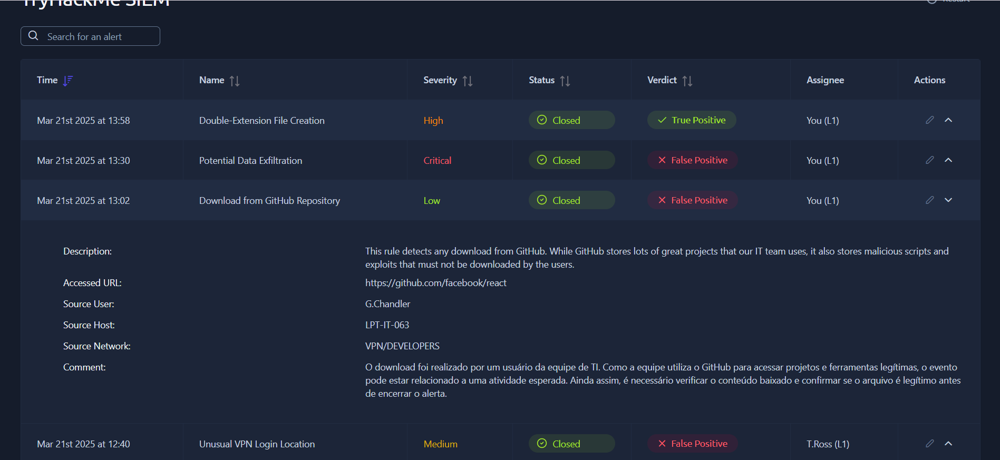

# TryHackMe: SOC L1 Alert Triage

## 🎯 Objetivo

Praticar a triagem de alertas em um ambiente simulado de SOC L1: analisar cada alerta, escrever uma descrição do que aconteceu e classificar como True Positive ou False Positive, justificando o motivo da classificação.

## 📋 Sobre o lab

- Plataforma: TryHackMe (SIEM simulado)
- A fila tinha 5 alertas. Fiquei responsável por 3, documentados abaixo.
- O lab só dava acesso às informações do próprio alerta, sem logs adicionais nem ferramentas de consulta. Por isso, as conclusões partem do contexto que o alerta traz.

## 📊 Resumo

| Alerta | Severidade | Veredito | Motivo em uma linha |
|---|---|---|---|
| Double-Extension File Creation | High | True Positive | Executável disfarçado de vídeo, baixado de domínio suspeito |
| Potential Data Exfiltration | Critical | False Positive | Tráfego de sala de reunião para o Zoom |
| Download from GitHub Repository | Low | False Positive | Repositório conhecido, usuário de TI, rede de desenvolvedores |

---

## 🚨 Alerta 1: Double-Extension File Creation (High, True Positive)

**Dados do alerta**
- Host: LPT-HR-009
- Usuário: S.Conway
- Processo: chrome.exe
- Arquivo: `C:\Users\S.Conway\Downloads\cats2025.mp4.exe`
- Origem do arquivo (MotW): `freecatvideoshd[.]monster`
- MD5: `14d8486f3f63875ef93cfd240c5dc10b`

**Por que classifiquei como True Positive**
- O nome sugere um vídeo (`.mp4`), mas a extensão real é `.exe`. É a técnica de dupla extensão, usada pra enganar o usuário.
- O arquivo veio pelo navegador, de um domínio com cara de isca ("vídeos de gatos grátis").
- O host é de um usuário do RH, ou seja, uma pessoa que não tem motivo pra baixar executáveis.

**O que eu recomendaria num ambiente real**
- Verificar se o arquivo foi executado no host
- Consultar o hash e o domínio em fontes de reputação
- Isolar a máquina e bloquear o domínio
- Escalar para o L2 e avisar o usuário

### Print

---

## 🚨 Alerta 2: Potential Data Exfiltration (Critical, False Positive)

**Dados do alerta**
- Origem: 192.168.45.66, rede `UK04/MEETINGROOM`
- Destino: `*.zoom.us`
- Enviado: 5,8 GB | Recebido: 5,2 GB

**Por que classifiquei como False Positive**
- A origem é uma sala de reunião e o destino é o Zoom, um serviço legítimo.
- O volume enviado e o recebido são parecidos, o que combina com videochamada (áudio e vídeo nos dois sentidos). Exfiltração costuma ser bem mais unilateral. Essa é uma interpretação minha a partir dos números.
- A regra dispara por volume (5 GB ou mais), então uma reunião longa em HD pode ativar o alerta sem ter nada de malicioso.

### Print

---

## 🚨 Alerta 3: Download from GitHub Repository (Low, False Positive)

**Dados do alerta**
- URL: `github.com/facebook/react`
- Usuário: G.Chandler | Host: LPT-IT-063
- Rede: `VPN/DEVELOPERS`

**Por que classifiquei como False Positive**
- O repositório é o React, um projeto open source muito conhecido.
- O usuário é da equipe de TI e a rede é a de desenvolvedores, então o download é compatível com o trabalho dele.
- A regra dispara pra qualquer download do GitHub, então o alerta sozinho não indica risco.

**Observação:** num ambiente real, eu ainda conferiria com a pessoa ou no ticket se o download era esperado.

### Print

---

## ⚠️ Limitações

- Sem acesso a logs adicionais, endpoint ou ferramentas de consulta, cada classificação se baseou só nos dados do alerta.
- Em um ambiente real, eu validaria essas conclusões com enriquecimento (reputação de IP, domínio e hash) e correlação de eventos.

## 📚 Lições aprendidas

- A severidade do alerta não diz o risco real: nos meus 3 alertas, o **Critical** e o **Low** eram falsos positivos, e o **High** era o verdadeiro.
- Contexto muda tudo: origem, destino, tipo de usuário e rede ajudam a separar tráfego normal de atividade suspeita.
- Um alerta não é necessariamente um incidente. Regras baseadas em volume ou em serviço (GitHub, por exemplo) geram falso positivo com facilidade.
- Vale sempre registrar por que cheguei ao veredito, e não só qual foi.
